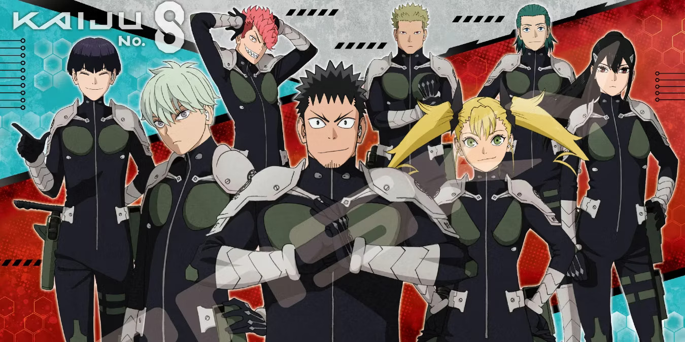

# Anime series kaiju no.8

# Description
With the highest rate of kaiju-emergence in the world, Japan frequently faces deadly monster attacks, which the Japan Defense Force works tirelessly to neutralize. For Kafka Hibino, who is tasked with cleaning up the remains of these creatures, joining the force has always been a lifelong aspiration. But as he unexpectedly undergoes a metamorphosis, he finds himself grappling with a difficult quandary - how can he fight against kaiju when he has become one himself?

# Author of kaiju no.8 

"Kaiju No. 8" is a popular manga series written and illustrated by Naoya Matsumoto. It debuted on Shueisha's Shonen Jump+ website in July 2020 and quickly garnered a large following due to its engaging storyline and fresh take on the kaiju genre. The story revolves around Kafka Hibino, a man whose mundane job involves cleaning up after kaiju attacks. His life takes a dramatic turn when he gains the ability to transform into a kaiju himself, leading to a series of thrilling conflicts and challenges. Matsumoto's blend of dynamic artwork and compelling character development has made "Kaiju No. 8" one of the standout manga releases in recent years, appealing to fans of action-packed, supernatural narratives.
# Characters

Kafka Hibino:
Kafka is the protagonist of "Kaiju No. 8". As a child, he dreamed of joining the Defense Forces to fight kaiju alongside his friend Mina. However, as an adult, he ends up working for a cleanup crew that deals with the aftermath of kaiju attacks. Kafka's life changes drastically after he becomes infected by a kaiju parasite, which gives him the ability to transform into a powerful kaiju himself, dubbed "Kaiju No. 8" by the Defense Forces.

Mina Ashiro:
Mina is Kafka’s childhood friend and the captain of the Third Division of the Defense Forces. She is a highly respected and powerful soldier who has achieved considerable success in her career. Mina is dedicated and driven, and she has a deep personal motivation to exterminate kaiju due to past trauma involving the creatures.

Reno Ichikawa:
Reno is Kafka’s cheerful and optimistic younger colleague in the cleanup crew. He admires the Defense Forces and, like Kafka, harbors ambitions of joining them. Reno is supportive and loyal, and his dynamic with Kafka adds a layer of camaraderie and humor to the series.

Kikoru Shinomiya:
Kikoru is a talented and ambitious new recruit in the Defense Forces, and the daughter of the Defense Force’s commander. She is determined to prove her worth and step out of her father’s shadow. Kikoru initially looks down on Kafka but gradually begins to respect him as she learns more about his true capabilities and his character.

Gen Narumi:
An elite officer in the Defense Forces, known for his exceptional skills and strength. Narumi is charismatic and takes great pride in his role. He plays a significant part in the series, especially as the plot delves deeper into the structure and politics of the Defense Forces.

Commander Shinomiya:
The commander of the Defense Forces and Kikoru’s father. He is a stern and imposing figure who holds a significant presence within the organization and plays a critical role in the overarching decisions regarding the kaiju threats and the use of Kafka’s abilities.
