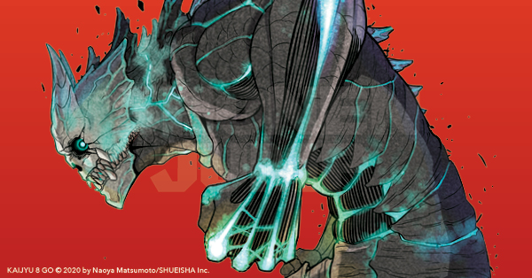

# Anime series kaiju no.8

# Description
With the highest rate of kaiju-emergence in the world, Japan frequently faces deadly monster attacks, which the Japan Defense Force works tirelessly to neutralize. For Kafka Hibino, who is tasked with cleaning up the remains of these creatures, joining the force has always been a lifelong aspiration. But as he unexpectedly undergoes a metamorphosis, he finds himself grappling with a difficult quandary - how can he fight against kaiju when he has become one himself?

# Author of kaiju no.8 

"Kaiju No. 8" is a popular manga series written and illustrated by Naoya Matsumoto. It debuted on Shueisha's Shonen Jump+ website in July 2020 and quickly garnered a large following due to its engaging storyline and fresh take on the kaiju genre. The story revolves around Kafka Hibino, a man whose mundane job involves cleaning up after kaiju attacks. His life takes a dramatic turn when he gains the ability to transform into a kaiju himself, leading to a series of thrilling conflicts and challenges. Matsumoto's blend of dynamic artwork and compelling character development has made "Kaiju No. 8" one of the standout manga releases in recent years, appealing to fans of action-packed, supernatural narratives.
